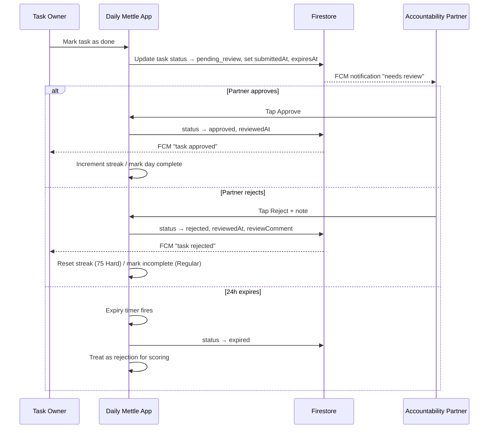
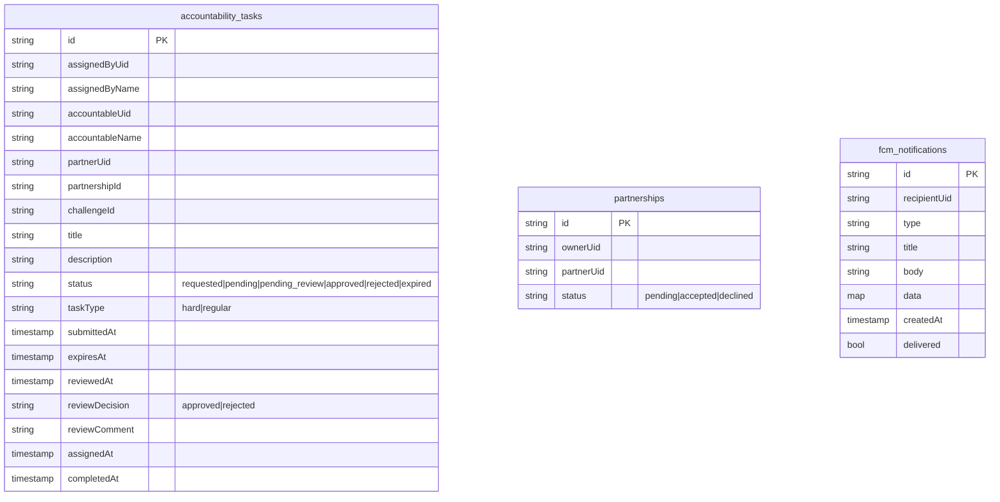
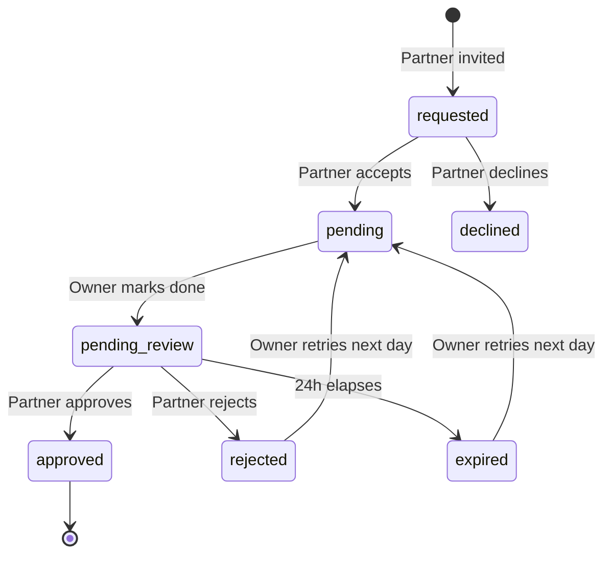

# Design Document: Accountability Partner

## Overview

The Accountability Partner feature transforms the Daily Mettle app from a self-tracked challenge tool into a socially-validated accountability system. Users invite external partners who must approve or reject daily task completions within a 24-hour window. Rejections and expired reviews carry real consequences: streak resets for 75 Hard tasks and reduced completion percentages for regular tasks.

The design builds on the existing `AccountabilityService`, `AccountabilityBloc`, and `AccountabilityTask` model — extending them with a review workflow, client-side expiry timer, FCM notification payloads, and stricter Firestore security rules. All logic runs client-side or via Firestore document writes (no Cloud Functions available).

### Key Design Decisions

1. **Client-side expiry** — A periodic timer checks for expired reviews since Cloud Functions are unavailable. Each task stores `submittedAt` and `expiresAt` timestamps; the client queries for overdue tasks on app open and via a background timer.
2. **Task-level partnership** — Each `AccountabilityTask` links to exactly one partner via `partnerUid`. The existing `partnerships` collection tracks the relationship; the task document tracks the review workflow.
3. **Immutable reviews** — Once a partner submits a review (approve/reject), the decision is final. The `reviewedAt` timestamp acts as a lock.
4. **FCM via Firestore writes** — Notifications are triggered by writing to an `fcm_notifications` collection. A lightweight Firestore-triggered extension (or the client of the receiving user on next app open) processes these into local notifications.

## Architecture

### High-Level Data Flow



### Firestore Collections



## Components and Interfaces

### Modified Components

| Component | File | Changes |
|-----------|------|---------|
| `AccountabilityTask` | `data/models/accountability_task.dart` | Add `pending_review`, `expired` status values; add `submittedAt`, `expiresAt`, `reviewedAt`, `reviewDecision`, `reviewComment`, `taskType` fields |
| `AccountabilityService` | `data/datasource/accountability_service.dart` | Add `submitForReview()`, `approveTask()`, `rejectTask()`, `checkExpiredTasks()`, `sendNotification()` methods |
| `AccountabilityBloc` | `presentation/bloc/accountability_bloc.dart` | Add review workflow events/states, expiry timer |
| Firestore Rules | `firestore.rules` | Tighten `accountability_tasks` read rules, add `fcm_notifications` rules |

### New Components

| Component | File | Purpose |
|-----------|------|---------|
| `ReviewExpiryService` | `data/datasource/review_expiry_service.dart` | Client-side timer + Firestore query for expired reviews |
| `AccountabilityNotificationService` | `data/datasource/accountability_notification_service.dart` | Build and write FCM notification documents |
| `PartnerReviewWorkflow` | (logic within BLoC) | Orchestrates the mark-done → pending_review → approve/reject/expire flow |

### BLoC Events (New)

```dart
/// Task owner marks a task as done → triggers pending_review
class SubmitTaskForReview extends AccountabilityEvent {
  final String taskId;
  const SubmitTaskForReview(this.taskId);
}

/// Partner approves a pending review
class ApproveTaskReview extends AccountabilityEvent {
  final String taskId;
  final String? improvementNote; // up to 500 chars
  const ApproveTaskReview(this.taskId, {this.improvementNote});
}

/// Partner rejects a pending review
class RejectTaskReview extends AccountabilityEvent {
  final String taskId;
  final String? improvementNote; // up to 500 chars, required on reject
  const RejectTaskReview(this.taskId, {this.improvementNote});
}

/// Fired by expiry timer when tasks pass their 24h window
class ExpireOverdueTasks extends AccountabilityEvent {}

/// Check and process expired tasks on app open
class CheckExpiredTasks extends AccountabilityEvent {}
```

### BLoC States (New)

```dart
/// Emitted when a task transitions to pending_review
class TaskSubmittedForReview extends AccountabilityState {
  final String taskId;
  final DateTime expiresAt;
  const TaskSubmittedForReview(this.taskId, this.expiresAt);
}

/// Emitted when a partner's review is recorded
class TaskReviewCompleted extends AccountabilityState {
  final String taskId;
  final String decision; // 'approved' or 'rejected'
  final String? comment;
  const TaskReviewCompleted(this.taskId, this.decision, {this.comment});
}

/// Emitted when tasks expire
class TasksExpired extends AccountabilityState {
  final List<String> expiredTaskIds;
  const TasksExpired(this.expiredTaskIds);
}

/// Emitted when streak is impacted
class StreakImpacted extends AccountabilityState {
  final int newStreakDay;
  final String reason; // 'rejected', 'expired', 'approved'
  const StreakImpacted(this.newStreakDay, this.reason);
}
```

### State Machine: Task Review Lifecycle



## Data Models

### AccountabilityTask Extensions

```dart
enum AccountabilityTaskStatus {
  requested,
  pending,
  completed,      // legacy — kept for backward compat
  declined,
  approved,
  pendingReview,  // NEW: waiting for partner review
  rejected,       // NEW: partner rejected
  expired,        // NEW: 24h window elapsed
}

// New fields added to AccountabilityTask:
class AccountabilityTask {
  // ... existing fields ...
  
  /// Type of task for scoring: 'hard' (75 Hard) or 'regular'
  final String taskType;
  
  /// When the owner submitted for review
  final DateTime? submittedAt;
  
  /// submittedAt + 24 hours — the deadline for partner review
  final DateTime? expiresAt;
  
  /// When the partner submitted their review
  final DateTime? reviewedAt;
  
  /// 'approved' or 'rejected'
  final String? reviewDecision;
  
  /// Partner's improvement note (max 500 chars)
  final String? reviewComment;
  
  /// Firebase UID of the assigned reviewing partner
  final String? partnerUid;
}
```

### FCM Notification Document

```dart
/// Written to `fcm_notifications/{id}` in Firestore.
/// The receiving client reads this on app open or via Firestore listener.
class FcmNotificationDoc {
  final String id;
  final String recipientUid;
  final String type;       // notification type key
  final String title;
  final String body;
  final Map<String, String> data; // deep-link payload
  final DateTime createdAt;
  final bool delivered;
}
```

### FCM Notification Payload Structure

| Type | Title | Body | Data |
|------|-------|------|------|
| `invitation_received` | "Partner Invitation" | "{SenderName} invited you to review '{TaskName}'" | `{type: invitation_received, taskId, partnershipId}` |
| `invitation_accepted` | "Invitation Accepted" | "{PartnerName} accepted your invitation" | `{type: invitation_accepted, partnershipId}` |
| `invitation_declined` | "Invitation Declined" | "{PartnerName} declined your invitation" | `{type: invitation_declined, partnershipId}` |
| `task_needs_review` | "{OwnerName}'s Task" | "'{TaskName}' needs your review" | `{type: task_needs_review, taskId}` |
| `review_approved` | "Task Approved ✅" | "Your partner approved '{TaskName}'" | `{type: review_approved, taskId}` |
| `review_rejected` | "Task Needs Work" | "Your partner rejected '{TaskName}': {Comment}" | `{type: review_rejected, taskId}` |
| `review_reminder_20h` | "Review Reminder ⏰" | "Only 4 hours left to review '{TaskName}'" | `{type: review_reminder, taskId}` |
| `review_expired` | "Review Expired" | "Review window closed — '{TaskName}' marked incomplete" | `{type: review_expired, taskId}` |

### 24-Hour Expiry Mechanism

Since Cloud Functions are unavailable, expiry runs client-side:

```dart
class ReviewExpiryService {
  Timer? _expiryTimer;
  
  /// Called on app start and after each review submission.
  /// Queries Firestore for tasks in pending_review status with expiresAt < now.
  Future<List<String>> checkAndExpireTasks() async {
    final now = DateTime.now();
    final snap = await _db
        .collection('accountability_tasks')
        .where('status', isEqualTo: 'pendingReview')
        .where('expiresAt', isLessThan: Timestamp.fromDate(now))
        .get();
    
    final batch = _db.batch();
    final expiredIds = <String>[];
    for (final doc in snap.docs) {
      batch.update(doc.reference, {
        'status': 'expired',
        'reviewedAt': FieldValue.serverTimestamp(),
      });
      expiredIds.add(doc.id);
    }
    await batch.commit();
    return expiredIds;
  }
  
  /// Starts a periodic timer (every 5 minutes) to check for expiry.
  void startPeriodicCheck() {
    _expiryTimer?.cancel();
    _expiryTimer = Timer.periodic(
      const Duration(minutes: 5),
      (_) => checkAndExpireTasks(),
    );
  }
  
  /// Schedules a precise timer for the next known expiry.
  void scheduleNextExpiry(DateTime expiresAt) {
    final delay = expiresAt.difference(DateTime.now());
    if (delay.isNegative) {
      checkAndExpireTasks();
      return;
    }
    Timer(delay, () => checkAndExpireTasks());
  }
}
```

**Dual-check strategy:**
1. **On app open**: Query all `pendingReview` tasks where `expiresAt < now`, batch-update to `expired`.
2. **Periodic timer**: Every 5 minutes while app is foregrounded, re-run the expiry query.
3. **Precise timer**: When a task enters `pendingReview`, schedule a timer for exactly `expiresAt`. If the app is backgrounded, the on-open check catches it.

### Firestore Security Rules Additions

```javascript
// ── accountability_tasks (UPDATED) ──────────────────────────────────
match /accountability_tasks/{taskId} {
  // Read: only the task owner (assignedByUid) and the assigned partner (partnerUid)
  allow read: if request.auth != null
              && (resource.data.assignedByUid == request.auth.uid
                  || resource.data.accountableUid == request.auth.uid
                  || resource.data.partnerUid == request.auth.uid);
  
  // Create: only the assigner
  allow create: if request.auth != null
                && request.resource.data.assignedByUid == request.auth.uid;
  
  // Update: assigner can update non-review fields;
  //         partnerUid can only update review fields (status, reviewDecision, reviewComment, reviewedAt)
  //         accountableUid can update status to pendingReview (mark done)
  allow update: if request.auth != null
                && (resource.data.assignedByUid == request.auth.uid
                    || resource.data.accountableUid == request.auth.uid
                    || resource.data.partnerUid == request.auth.uid);
  
  // Delete: only the assigner
  allow delete: if request.auth != null
                && resource.data.assignedByUid == request.auth.uid;
}

// ── fcm_notifications (NEW) ────────────────────────────────────────
match /fcm_notifications/{notifId} {
  // Any signed-in user can create a notification (sender writes it)
  allow create: if request.auth != null;
  
  // Only the recipient can read and mark as delivered
  allow read, update: if request.auth != null
                      && resource.data.recipientUid == request.auth.uid;
  
  // Recipient can delete (cleanup)
  allow delete: if request.auth != null
                && resource.data.recipientUid == request.auth.uid;
}
```

### Scoring Logic

```dart
/// Computes the impact of a review outcome on user progress.
class ReviewScoringEngine {
  
  /// For 75 Hard tasks:
  /// - approved → streak + 1
  /// - rejected or expired → streak reset to 1
  int compute75HardStreak(int currentStreak, String outcome) {
    if (outcome == 'approved') return currentStreak + 1;
    return 1; // reset
  }
  
  /// For Regular tasks:
  /// - approved → day counts as complete
  /// - rejected or expired → day counts as incomplete
  bool isRegularDayComplete(String outcome) {
    return outcome == 'approved';
  }
  
  /// Completion percentage = approved days / total days × 100
  double computeCompletionPercentage(List<String> dailyOutcomes) {
    if (dailyOutcomes.isEmpty) return 0.0;
    final approved = dailyOutcomes.where((o) => o == 'approved').length;
    return (approved / dailyOutcomes.length) * 100;
  }
  
  /// Regular task streak = consecutive approved days from most recent
  int computeRegularStreak(List<String> dailyOutcomes) {
    int streak = 0;
    for (final outcome in dailyOutcomes.reversed) {
      if (outcome == 'approved') {
        streak++;
      } else {
        break;
      }
    }
    return streak;
  }
}
```

## Correctness Properties

*A property is a characteristic or behavior that should hold true across all valid executions of a system — essentially, a formal statement about what the system should do. Properties serve as the bridge between human-readable specifications and machine-verifiable correctness guarantees.*

### Property 1: Authentication gate rejects unauthenticated users

*For any* invitation action (invite, accept, decline) attempted by a user without a valid Firebase UID, the system SHALL reject the action and return an error.

**Validates: Requirements 1.4**

### Property 2: One partner per task invariant

*For any* task that already has an assigned partner (partnerUid is non-null and partnership is accepted), attempting to assign a second partner SHALL fail without modifying the existing assignment.

**Validates: Requirements 2.5**

### Property 3: Invitation display completeness

*For any* pending invitation with an arbitrary task name, owner display name, and task type, the rendered invitation item SHALL contain all three data elements.

**Validates: Requirements 3.2**

### Property 4: Accept transitions partnership to accepted

*For any* pending partnership and any accepting user whose UID differs from the ownerUid, accepting SHALL set status to "accepted" and partnerUid to the acceptor's UID.

**Validates: Requirements 3.3**

### Property 5: Decline transitions partnership to declined

*For any* pending partnership and any declining user, declining SHALL set status to "declined".

**Validates: Requirements 3.4**

### Property 6: Self-approval prevention and pending_review transition

*For any* task with an active partnership (status=accepted, partnerUid non-null), when the task owner marks the task as done, the resulting status SHALL be `pendingReview` (not `approved` or `completed`), submittedAt SHALL be non-null, and expiresAt SHALL equal submittedAt + 24 hours.

**Validates: Requirements 4.1, 4.2, 5.1, 5.3**

### Property 7: Review authorization

*For any* user attempting to submit a review decision (approve or reject) on a task, the action SHALL succeed only if the user's Firebase UID matches the task's `partnerUid` field.

**Validates: Requirements 4.3**

### Property 8: Review state transitions

*For any* task in `pendingReview` status, a partner approval SHALL set status to `approved` and reviewedAt to a non-null timestamp, and a partner rejection SHALL set status to `rejected` and reviewedAt to a non-null timestamp.

**Validates: Requirements 6.2, 6.3**

### Property 9: Improvement note length validation

*For any* string of length ≤ 500 characters, attaching it as an improvement note SHALL succeed. *For any* string of length > 500 characters, the system SHALL reject the note.

**Validates: Requirements 6.4**

### Property 10: Review immutability

*For any* task where reviewedAt is non-null (status is `approved`, `rejected`, or `expired`), any subsequent attempt to submit a review SHALL fail without modifying the existing decision.

**Validates: Requirements 6.5, 8.4**

### Property 11: Expiry detection

*For any* task in `pendingReview` status where the current time exceeds `expiresAt`, the expiry check SHALL transition the task status to `expired`.

**Validates: Requirements 7.1**

### Property 12: Expired equals rejected for scoring

*For any* task, the scoring impact of an `expired` outcome SHALL be identical to the scoring impact of a `rejected` outcome. Specifically: for 75 Hard tasks, streak resets to 1; for regular tasks, the day is marked incomplete.

**Validates: Requirements 7.2, 8.1, 8.2, 9.1, 9.2**

### Property 13: Streak increment on approval (75 Hard)

*For any* current streak value N ≥ 1 and a 75 Hard task receiving an `approved` review, the resulting streak SHALL be N + 1.

**Validates: Requirements 8.3**

### Property 14: Completion percentage formula

*For any* list of daily outcomes for a regular task, the completion percentage SHALL equal (count of 'approved' outcomes / total count of outcomes) × 100.

**Validates: Requirements 9.3**

### Property 15: Regular task streak is consecutive approved days

*For any* chronologically-ordered sequence of daily review outcomes for a regular task, the streak SHALL equal the length of the longest consecutive run of 'approved' outcomes ending at the most recent day.

**Validates: Requirements 9.4**

### Property 16: Partner data visibility restriction

*For any* partner UID and any set of tasks in the system, the tasks visible to that partner SHALL be exactly those where the task's `partnerUid` field matches the partner's UID. No other task data SHALL be accessible.

**Validates: Requirements 11.1**

## Error Handling

| Scenario | Handling |
|----------|----------|
| Network offline during review submission | Queue review in local Hive store, retry on reconnect. Show "Pending sync" indicator. |
| Partner app not opened within 24h | Client-side expiry timer marks task as expired on owner's device. Owner receives notification. |
| Both devices offline during expiry | On next app open, the expiry check query catches all overdue tasks regardless of when the app was last active. |
| Self-invite attempt | Reject immediately with "You cannot invite yourself" error before any Firestore write. |
| Duplicate partner assignment | Check `partnerUid` field before writing; return error if already assigned. |
| Firestore permission denied | Surface user-friendly error "Unable to complete action. Please check your connection and try again." |
| FCM token expired/missing | Gracefully degrade — write notification doc to Firestore anyway; recipient reads it on next app open as an in-app notification. |
| Review submitted after expiry | Check `expiresAt` before accepting review; reject late reviews with "Review window has closed." |
| Improvement note exceeds 500 chars | Validate client-side before submission; truncate display but reject write if > 500. |

## Testing Strategy

### Unit Tests (Example-Based)

- Widget tests for conditional UI rendering (auth gate buttons, badge indicators, section visibility)
- Navigation tests for deep-link routing from notification payloads
- Edge case tests: self-invite rejection, empty email validation, offline state handling

### Property-Based Tests

Property-based testing applies to the core scoring engine, state transition logic, and authorization checks. The feature contains pure functions (streak computation, percentage calculation, status transitions) with clear input/output behavior and universal properties.

**Library**: `dart_check` (Dart property-based testing library)
**Configuration**: Minimum 100 iterations per property test
**Tag format**: `Feature: accountability-partner, Property {N}: {property_text}`

Properties to implement:
- Properties 1, 2, 4–16 as individual property-based tests
- Properties 6, 8, 11 focus on state machine transitions
- Properties 12–15 focus on the `ReviewScoringEngine` pure functions
- Property 7, 10, 16 focus on authorization/access control logic

### Integration Tests

- Firestore security rules tests using Firebase Emulator
- FCM notification payload formatting and delivery verification
- End-to-end review workflow (invite → accept → submit → review → scoring impact)
- Partnership removal revokes access test

### What Needs Modification vs New Code

| Area | Existing | Action |
|------|----------|--------|
| `AccountabilityTaskStatus` enum | Has `requested`, `pending`, `completed`, `declined`, `approved` | **Modify**: Add `pendingReview`, `rejected`, `expired` |
| `AccountabilityTask` model | Has proof fields, basic status | **Modify**: Add `taskType`, `submittedAt`, `expiresAt`, `reviewedAt`, `reviewDecision`, `reviewComment`, `partnerUid` |
| `AccountabilityService` | Has create/accept/complete task methods | **Modify**: Add `submitForReview()`, `approveTask()`, `rejectTask()`, `checkExpiredTasks()` |
| `AccountabilityBloc` | Has task request accept/decline | **Modify**: Add review workflow events/states, expiry timer |
| `accountability_bloc_event.dart` | Has task request events | **Modify**: Add `SubmitTaskForReview`, `ApproveTaskReview`, `RejectTaskReview`, `ExpireOverdueTasks` |
| `accountability_bloc_state.dart` | Has task request states | **Modify**: Add `TaskSubmittedForReview`, `TaskReviewCompleted`, `TasksExpired`, `StreakImpacted` |
| `firestore.rules` | Has broad read on accountability_tasks | **Modify**: Restrict read to owner + partner + accountable user |
| `ReviewExpiryService` | Does not exist | **New**: Client-side timer + expiry query |
| `AccountabilityNotificationService` | Does not exist | **New**: Builds and writes FCM notification docs |
| `ReviewScoringEngine` | Does not exist | **New**: Pure functions for streak/percentage computation |
| FCM notification collection | Does not exist | **New**: `fcm_notifications` Firestore collection + security rules |
