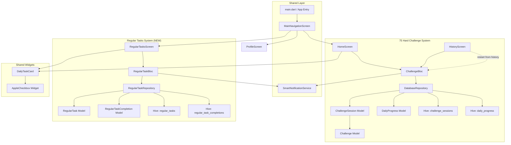
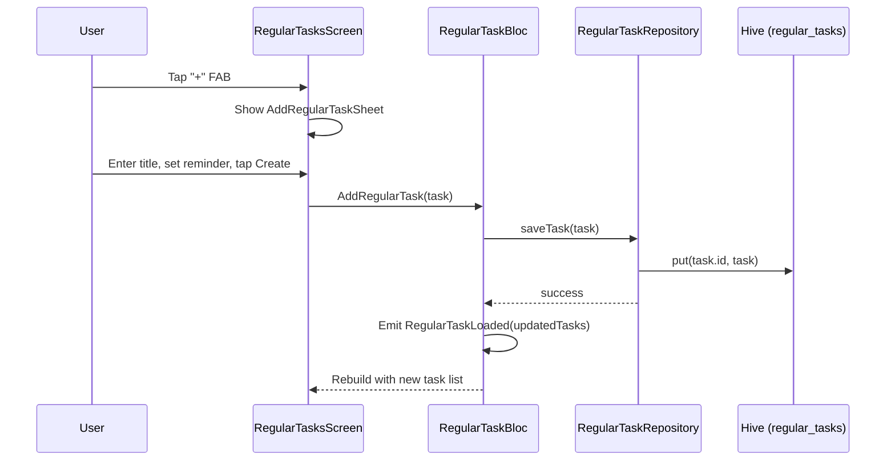
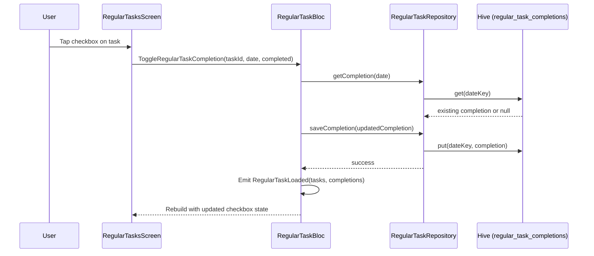
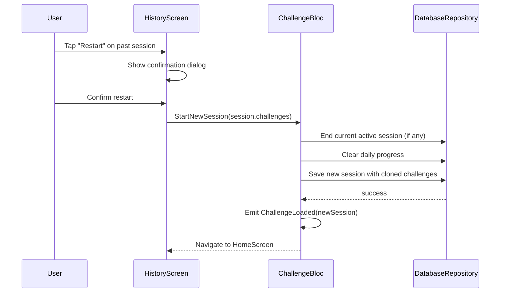

# Design Document: Independent Regular Tasks

## Overview

The current 75 Hard Challenge app tightly couples Regular Tasks with the 75 Hard Challenge system — both share the same `Challenge` model, `ChallengeSession` storage, `ChallengeBloc` state management, and `DailyProgress` tracking. This means regular tasks cannot exist without an active 75 Hard session, both tabs show data from the same source, and toggling a regular task fires events through the challenge BLoC.

This design introduces a fully independent Regular Tasks system with its own Hive storage box, dedicated BLoC, separate data model, and independent completion tracking. Regular tasks will work without any 75 Hard session, are skippable (no reset on miss), and have their own per-day completion history. Additionally, the design covers an Apple-style rounded checkbox widget to replace the current pill toggle, and a history restart feature allowing users to re-launch a 75 Hard session from a previous attempt's task configuration.

The separation follows a clean vertical-slice architecture: each system (75 Hard, Regular Tasks) owns its full stack from model → repository → BLoC → UI, sharing only common widgets and services where appropriate.

## Architecture



## Sequence Diagrams

### Regular Task Creation (Independent Flow)



### Regular Task Completion Toggle



### History Restart Flow



## Components and Interfaces

### Component 1: RegularTask Model

**Purpose**: Standalone data model for regular tasks, independent of the Challenge model used by 75 Hard.

**Interface**:
```dart
@HiveType(typeId: 3)
class RegularTask extends Equatable {
  @HiveField(0)
  final String id;

  @HiveField(1)
  final String title;

  @HiveField(2)
  final String? reminderTime; // Format: "HH:mm"

  @HiveField(3)
  final bool isReminderEnabled;

  @HiveField(4)
  final String? imagePath;

  @HiveField(5)
  final String? iconName;

  @HiveField(6)
  final int? iconColor;

  @HiveField(7)
  final String category;

  @HiveField(8)
  final String reminderType; // 'once', 'hourly', 'custom'

  @HiveField(9)
  final int reminderStartHour;

  @HiveField(10)
  final int reminderEndHour;

  @HiveField(11)
  final bool allowNightReminders;

  @HiveField(12)
  final int? reminderIntervalMinutes;

  @HiveField(13)
  final DateTime createdAt;

  @HiveField(14)
  final bool isArchived;

  RegularTask copyWith({...});
  Map<String, dynamic> toJson();
  factory RegularTask.fromJson(Map<String, dynamic> json);
}
```

**Responsibilities**:
- Store regular task definition independently of any challenge session
- Support archiving (soft delete) so completion history is preserved
- Provide serialization for backup/restore

### Component 2: RegularTaskCompletion Model

**Purpose**: Per-day completion tracking for regular tasks, independent of DailyProgress.

**Interface**:
```dart
@HiveType(typeId: 4)
class RegularTaskCompletion extends Equatable {
  @HiveField(0)
  final DateTime date;

  @HiveField(1)
  final Map<String, bool> taskCompletions; // taskId -> completed

  RegularTaskCompletion copyWith({...});
  Map<String, dynamic> toJson();
  factory RegularTaskCompletion.fromJson(Map<String, dynamic> json);
}
```

**Responsibilities**:
- Track which regular tasks were completed on a given day
- Completely separate from DailyProgress (75 Hard completions)

### Component 3: RegularTaskRepository

**Purpose**: Data access layer for regular tasks, using its own Hive boxes.

**Interface**:
```dart
class RegularTaskRepository {
  static const String _tasksBoxName = 'regular_tasks';
  static const String _completionsBoxName = 'regular_task_completions';

  Future<void> init();
  Future<void> saveTask(RegularTask task);
  Future<void> deleteTask(String taskId);
  Future<void> archiveTask(String taskId);
  List<RegularTask> getAllTasks();
  List<RegularTask> getActiveTasks();
  Future<void> saveCompletion(RegularTaskCompletion completion);
  RegularTaskCompletion? getCompletion(DateTime date);
  List<RegularTaskCompletion> getCompletionsInRange(DateTime start, DateTime end);
}
```

**Responsibilities**:
- Manage `regular_tasks` and `regular_task_completions` Hive boxes
- Provide CRUD operations for tasks and completions
- Never touch `challenge_sessions` or `daily_progress` boxes

### Component 4: RegularTaskBloc

**Purpose**: State management for the Regular Tasks system, completely independent of ChallengeBloc.

**Interface**:
```dart
class RegularTaskBloc extends Bloc<RegularTaskEvent, RegularTaskState> {
  final RegularTaskRepository _repository;
  final SmartNotificationService _notifications;

  RegularTaskBloc({
    required RegularTaskRepository repository,
    required SmartNotificationService notifications,
  });
}
```

**Responsibilities**:
- Handle all regular task events (load, add, delete, toggle completion)
- Manage regular task state independently
- Schedule/cancel notifications for regular tasks
- Never interact with ChallengeBloc or DatabaseRepository

### Component 5: AppleCheckbox Widget

**Purpose**: Apple-style rounded checkbox with snappy animation to replace the pill toggle.

**Interface**:
```dart
class AppleCheckbox extends StatefulWidget {
  final bool isChecked;
  final bool isEnabled;
  final ValueChanged<bool> onChanged;
  final double size;

  const AppleCheckbox({
    required this.isChecked,
    required this.isEnabled,
    required this.onChanged,
    this.size = 28.0,
  });
}
```

**Responsibilities**:
- Render empty circle when unchecked, filled green circle with white checkmark when checked
- Animate transition in 150ms (down from current 300ms pill toggle)
- Provide haptic feedback on toggle
- Accessible: proper semantics label for screen readers

## Data Models

### RegularTask

```dart
@HiveType(typeId: 3)
class RegularTask extends Equatable {
  @HiveField(0)  final String id;
  @HiveField(1)  final String title;
  @HiveField(2)  final String? reminderTime;
  @HiveField(3)  final bool isReminderEnabled;
  @HiveField(4)  final String? imagePath;
  @HiveField(5)  final String? iconName;
  @HiveField(6)  final int? iconColor;
  @HiveField(7)  final String category;
  @HiveField(8)  final String reminderType;
  @HiveField(9)  final int reminderStartHour;
  @HiveField(10) final int reminderEndHour;
  @HiveField(11) final bool allowNightReminders;
  @HiveField(12) final int? reminderIntervalMinutes;
  @HiveField(13) final DateTime createdAt;
  @HiveField(14) final bool isArchived;
}
```

**Validation Rules**:
- `id` must be non-empty, unique
- `title` must be non-empty, max 100 characters
- `reminderStartHour` in range [0, 23]
- `reminderEndHour` in range [0, 23], must be >= `reminderStartHour` (or wraps for overnight)
- `reminderIntervalMinutes` if set, must be > 0
- `createdAt` must be a valid DateTime
- `isArchived` defaults to false

### RegularTaskCompletion

```dart
@HiveType(typeId: 4)
class RegularTaskCompletion extends Equatable {
  @HiveField(0) final DateTime date;
  @HiveField(1) final Map<String, bool> taskCompletions;
}
```

**Validation Rules**:
- `date` is normalized to midnight (year, month, day only)
- `taskCompletions` keys must correspond to existing RegularTask IDs
- One entry per calendar day (keyed by "YYYY-MM-DD")

### Hive Type ID Allocation

| Type ID | Model | Box Name |
|---------|-------|----------|
| 0 | Challenge | (embedded in challenge_sessions) |
| 1 | DailyProgress | daily_progress |
| 2 | ChallengeSession | challenge_sessions |
| 3 | RegularTask (NEW) | regular_tasks |
| 4 | RegularTaskCompletion (NEW) | regular_task_completions |

</text>
</invoke>

## Key Functions with Formal Specifications

### Function 1: RegularTaskRepository.saveTask()

```dart
Future<void> saveTask(RegularTask task) async {
  await _ensureInitialized();
  await _tasksBox!.put(task.id, task);
}
```

**Preconditions:**
- Repository is initialized (Hive boxes are open)
- `task.id` is non-empty
- `task.title` is non-empty

**Postconditions:**
- Task is persisted in `regular_tasks` Hive box keyed by `task.id`
- If a task with the same ID existed, it is overwritten (update semantics)
- No side effects on `challenge_sessions` or `daily_progress` boxes

**Loop Invariants:** N/A

### Function 2: RegularTaskRepository.getCompletion()

```dart
RegularTaskCompletion? getCompletion(DateTime date) {
  final key = _dateToKey(date);
  return _completionsBox?.get(key);
}
```

**Preconditions:**
- Repository is initialized
- `date` is a valid DateTime

**Postconditions:**
- Returns `RegularTaskCompletion` for the given date, or `null` if none exists
- No mutations to any data

**Loop Invariants:** N/A

### Function 3: RegularTaskBloc._onToggleCompletion()

```dart
Future<void> _onToggleCompletion(
  ToggleRegularTaskCompletion event,
  Emitter<RegularTaskState> emit,
) async;
```

**Preconditions:**
- `event.taskId` corresponds to an existing RegularTask
- `event.date` is a valid DateTime (typically today)

**Postconditions:**
- The completion state for `event.taskId` on `event.date` is toggled
- A new `RegularTaskLoaded` state is emitted with updated completions
- If `event.isCompleted` is true, the task's reminder for today is cancelled
- No interaction with ChallengeBloc or DatabaseRepository

**Loop Invariants:** N/A

### Function 4: AppleCheckbox animation

```dart
void _animateToggle(bool newValue) {
  if (newValue) {
    _controller.forward(); // 150ms to filled green circle + checkmark
  } else {
    _controller.reverse(); // 150ms back to empty circle
  }
  widget.onChanged(newValue);
}
```

**Preconditions:**
- Widget is mounted and `_controller` is initialized
- `widget.isEnabled` is true

**Postconditions:**
- Animation completes in 150ms
- Visual state matches `newValue` (checked/unchecked)
- `onChanged` callback is invoked with `newValue`
- Haptic feedback is triggered

**Loop Invariants:** N/A

## Algorithmic Pseudocode

### Regular Task Streak Calculation

```dart
/// Calculates streak and stats for a regular task from completion history.
/// This replaces the current _calcStats that reads from DailyProgress.
RegularTaskStats calculateStats(
  String taskId,
  List<RegularTaskCompletion> completions,
) {
  // ASSERT: completions is sorted by date ascending
  final sorted = [...completions]..sort((a, b) => a.date.compareTo(b.date));

  int completed = 0;
  int missed = 0;
  int currentStreak = 0;
  int bestStreak = 0;
  int tempStreak = 0;

  for (final completion in sorted) {
    // INVARIANT: tempStreak == length of current consecutive completed run
    // INVARIANT: bestStreak >= tempStreak at start of each iteration
    final done = completion.taskCompletions[taskId] ?? false;
    if (done) {
      completed++;
      tempStreak++;
      if (tempStreak > bestStreak) bestStreak = tempStreak;
    } else {
      missed++;
      tempStreak = 0;
    }
  }
  currentStreak = tempStreak;

  // ASSERT: completed + missed == sorted.length
  // ASSERT: bestStreak >= currentStreak
  return RegularTaskStats(
    completed: completed,
    missed: missed,
    currentStreak: currentStreak,
    bestStreak: bestStreak,
    total: sorted.length,
  );
}
```

**Preconditions:**
- `taskId` is a valid regular task ID
- `completions` contains entries relevant to this task

**Postconditions:**
- Returns accurate streak/stats based solely on `regular_task_completions` data
- `completed + missed == total`
- `bestStreak >= currentStreak`

**Loop Invariants:**
- `tempStreak` equals the length of the current consecutive completed run
- `bestStreak` is the maximum of all completed runs seen so far

### Data Migration: Extract Regular Tasks from ChallengeSession

```dart
/// One-time migration to move existing regular tasks from ChallengeSession
/// into the new independent RegularTask storage.
Future<void> migrateRegularTasks(
  DatabaseRepository challengeRepo,
  RegularTaskRepository regularRepo,
) async {
  // Step 1: Find all sessions that contain regular tasks
  final allSessions = challengeRepo.getAllSessions();

  for (final session in allSessions) {
    final regularChallenges = session.challenges
        .where((c) => c.taskType == 'regular')
        .toList();

    for (final challenge in regularChallenges) {
      // Step 2: Check if already migrated (idempotent)
      final existing = regularRepo.getTaskById(challenge.id);
      if (existing != null) continue;

      // Step 3: Create RegularTask from Challenge
      final regularTask = RegularTask(
        id: challenge.id,
        title: challenge.title,
        reminderTime: challenge.reminderTime,
        isReminderEnabled: challenge.isReminderEnabled,
        imagePath: challenge.imagePath,
        iconName: challenge.iconName,
        iconColor: challenge.iconColor,
        category: challenge.category,
        reminderType: challenge.reminderType,
        reminderStartHour: challenge.reminderStartHour,
        reminderEndHour: challenge.reminderEndHour,
        allowNightReminders: challenge.allowNightReminders,
        reminderIntervalMinutes: challenge.reminderIntervalMinutes,
        createdAt: session.startDate,
        isArchived: !session.isActive,
      );

      await regularRepo.saveTask(regularTask);
    }

    // Step 4: Migrate completion data from DailyProgress
    if (session.isActive) {
      final progressList = challengeRepo.getProgressForSession(session.startDate);
      for (final progress in progressList) {
        var completion = regularRepo.getCompletion(progress.date);
        final taskCompletions = <String, bool>{};

        for (final challenge in regularChallenges) {
          final wasCompleted = progress.challengeCompletions[challenge.id] ?? false;
          taskCompletions[challenge.id] = wasCompleted;
        }

        if (taskCompletions.isNotEmpty) {
          completion = RegularTaskCompletion(
            date: progress.date,
            taskCompletions: {
              ...?completion?.taskCompletions,
              ...taskCompletions,
            },
          );
          await regularRepo.saveCompletion(completion);
        }
      }
    }
  }

  // Step 5: Remove regular tasks from active session's challenge list
  final activeSession = await challengeRepo.getActiveSession();
  if (activeSession != null) {
    final nonRegularChallenges = activeSession.challenges
        .where((c) => c.taskType != 'regular')
        .toList();
    if (nonRegularChallenges.length != activeSession.challenges.length) {
      final cleaned = activeSession.copyWith(challenges: nonRegularChallenges);
      await challengeRepo.updateSession(cleaned);
    }
  }
}
```

**Preconditions:**
- Both repositories are initialized
- Hive boxes for both systems are open

**Postconditions:**
- All `Challenge` objects with `taskType == 'regular'` are copied to `regular_tasks` box
- Completion data for regular tasks is copied from `daily_progress` to `regular_task_completions`
- Regular tasks are removed from the active `ChallengeSession.challenges` list
- Migration is idempotent (safe to run multiple times)
- 75 Hard data (hard/soft tasks) is untouched

### History Restart Algorithm

```dart
/// Restarts a 75 Hard session using the task configuration from a past session.
/// Only copies non-regular challenges (hard/soft tasks).
Future<void> restartFromHistory(
  ChallengeSession pastSession,
  ChallengeBloc bloc,
) {
  // ASSERT: pastSession.isActive == false (it's a historical session)

  // Step 1: Clone challenges, generating new IDs to avoid conflicts
  final clonedChallenges = pastSession.challenges
      .where((c) => c.taskType != 'regular')
      .map((c) => c.copyWith(
            id: DateTime.now().millisecondsSinceEpoch.toString() +
                '_${c.id.hashCode}',
          ))
      .toList();

  // Step 2: Dispatch StartNewSession with cloned challenges
  // This reuses existing BLoC logic: ends current session, clears progress, starts fresh
  bloc.add(StartNewSession(clonedChallenges));

  // ASSERT: A new active session exists with the same task titles/config
  // ASSERT: currentDay == 1
  // ASSERT: No daily progress entries exist for the new session
}
```

**Preconditions:**
- `pastSession` is not active (historical)
- `pastSession.challenges` is non-empty

**Postconditions:**
- A new active ChallengeSession is created with cloned challenges
- New session starts at day 1 with no progress
- Previous active session (if any) is ended
- Challenge IDs are unique (no collision with past session)

## Example Usage

### Providing RegularTaskBloc in the Widget Tree

```dart
// In main.dart — add RegularTaskBloc alongside ChallengeBloc
MultiBlocProvider(
  providers: [
    BlocProvider(
      create: (context) => ChallengeBloc(
        repository: DatabaseRepository(),
        smartNotifications: smartNotifications,
      )..add(LoadChallengeData()),
    ),
    BlocProvider(
      create: (context) => RegularTaskBloc(
        repository: RegularTaskRepository(),
        notifications: smartNotifications,
      )..add(LoadRegularTasks()),
    ),
  ],
  child: MaterialApp(...),
)
```

### Using AppleCheckbox in DailyTaskCard

```dart
// Replace the pill toggle in _buildCompletionWidget()
AppleCheckbox(
  isChecked: widget.isCompleted,
  isEnabled: widget.isEditable,
  onChanged: (value) => widget.onToggle(value),
  size: 28.0,
)
```

### RegularTasksScreen Using Its Own BLoC

```dart
// RegularTasksScreen no longer depends on ChallengeBloc
class RegularTasksScreen extends StatelessWidget {
  @override
  Widget build(BuildContext context) {
    return BlocBuilder<RegularTaskBloc, RegularTaskState>(
      builder: (context, state) {
        if (state is RegularTaskLoaded) {
          return ListView.builder(
            itemCount: state.tasks.length,
            itemBuilder: (context, index) {
              final task = state.tasks[index];
              final isCompleted = state.todayCompletions[task.id] ?? false;
              return DailyTaskCard(
                // DailyTaskCard accepts a common interface or adapts
                challenge: task.toChallenge(), // adapter for shared widget
                isCompleted: isCompleted,
                isEditable: true,
                onToggle: (completed) {
                  context.read<RegularTaskBloc>().add(
                    ToggleRegularTaskCompletion(
                      taskId: task.id,
                      date: DateTime.now(),
                      isCompleted: completed,
                    ),
                  );
                },
              );
            },
          );
        }
        return const Center(child: CircularProgressIndicator());
      },
    );
  }
}
```

### Restart from History

```dart
// In HistoryScreen, add a restart button to each session card
ElevatedButton.icon(
  onPressed: () {
    showDialog(
      context: context,
      builder: (_) => AlertDialog(
        title: const Text('Restart Challenge?'),
        content: const Text(
          'This will start a new 75 Hard session with the same tasks. '
          'Any current active session will be ended.',
        ),
        actions: [
          TextButton(
            onPressed: () => Navigator.pop(context),
            child: const Text('Cancel'),
          ),
          ElevatedButton(
            onPressed: () {
              Navigator.pop(context);
              final cloned = session.challenges
                  .where((c) => c.taskType != 'regular')
                  .map((c) => c.copyWith(
                        id: DateTime.now().millisecondsSinceEpoch.toString(),
                      ))
                  .toList();
              context.read<ChallengeBloc>().add(StartNewSession(cloned));
              Navigator.pop(context); // Close history screen
            },
            child: const Text('Restart'),
          ),
        ],
      ),
    );
  },
  icon: const Icon(Icons.replay),
  label: const Text('Restart with these tasks'),
)
```

## Correctness Properties

*A property is a characteristic or behavior that should hold true across all valid executions of a system — essentially, a formal statement about what the system should do. Properties serve as the bridge between human-readable specifications and machine-verifiable correctness guarantees.*

### Property 1: RegularTask serialization round-trip

*For any* valid RegularTask object, serializing it to JSON via `toJson()` and deserializing it back via `fromJson()` SHALL produce an equivalent RegularTask object.

**Validates: Requirement 1.5**

### Property 2: Completion date normalization

*For any* DateTime with arbitrary time components, saving a RegularTaskCompletion SHALL normalize the date to midnight (year, month, day only) and key the record by "YYYY-MM-DD" format, such that retrieving the completion by any DateTime on the same calendar day returns the same record.

**Validates: Requirement 1.4**

### Property 3: BLoC bidirectional independence

*For any* sequence of events dispatched to the RegularTaskBloc, the ChallengeBloc state SHALL remain unchanged, and *for any* sequence of events dispatched to the ChallengeBloc, the RegularTaskBloc state SHALL remain unchanged. Toggling a regular task completion never triggers ChallengeReset or modifies DailyProgress.

**Validates: Requirements 3.3, 3.4, 9.1**

### Property 4: Archive-on-delete preserves records

*For any* RegularTask that is deleted via the RegularTaskRepository, the task record SHALL still exist in storage with `isArchived` set to true, and the task's completion history SHALL remain accessible.

**Validates: Requirement 2.4**

### Property 5: Repository data isolation

*For any* sequence of RegularTaskRepository operations (save, delete, archive, toggle completion), the contents of the `challenge_sessions` and `daily_progress` Hive boxes SHALL remain unchanged.

**Validates: Requirements 2.5, 1.1, 1.2**

### Property 6: Streak and statistics invariants

*For any* RegularTask with a completion history of length N, the calculateStats function SHALL produce results where: (a) `completed + missed == total == N`, (b) `bestStreak >= currentStreak`, (c) `currentStreak` equals the length of the longest suffix of consecutive `true` values, and (d) `bestStreak` equals the length of the longest consecutive run of `true` values.

**Validates: Requirements 6.1, 6.2, 6.3, 6.4**

### Property 7: Migration correctness

*For any* set of ChallengeSession objects containing challenges with mixed taskTypes, running the Migration_Service SHALL: (a) copy all and only `taskType == 'regular'` challenges into the RegularTaskRepository, (b) transfer their completion data from DailyProgress to RegularTaskCompletion, (c) remove regular challenges from the active ChallengeSession, and (d) leave all hard and soft task data unchanged.

**Validates: Requirements 7.1, 7.2, 7.3, 7.5**

### Property 8: Migration idempotency

*For any* initial database state, running the Migration_Service twice SHALL produce the same result as running it once — no duplicate tasks, no duplicate completions, and no additional modifications to the Challenge_System.

**Validates: Requirement 7.4**

### Property 9: History restart produces unique non-regular clones

*For any* historical ChallengeSession, restarting from history SHALL create a new session containing only hard and soft challenges (no regular tasks), where every cloned challenge has a unique ID that differs from all challenge IDs in the source session.

**Validates: Requirements 8.2, 8.3, 8.5**

### Property 10: Regular tasks excluded from reset evaluation

*For any* day where all hard and soft tasks are completed but regular tasks are not, the Challenge_System missed-day check SHALL not trigger a ChallengeReset, and the day SHALL be considered complete for 75 Hard purposes.

**Validates: Requirements 9.2, 9.3**

## Error Handling

### Error Scenario 1: Hive Box Not Initialized

**Condition**: `RegularTaskRepository` methods called before `init()`
**Response**: `_ensureInitialized()` auto-initializes boxes before any operation
**Recovery**: Transparent to caller — boxes are opened on first access

### Error Scenario 2: Migration Fails Mid-Way

**Condition**: App crashes during `migrateRegularTasks()`
**Response**: Migration is idempotent — partially migrated tasks are detected by ID check
**Recovery**: Re-run migration on next app start; already-migrated tasks are skipped

### Error Scenario 3: Hive Type ID Conflict

**Condition**: TypeId 3 or 4 already registered by another adapter
**Response**: Check `Hive.isAdapterRegistered(typeId)` before registering
**Recovery**: Skip registration if already registered (same pattern as existing code)

### Error Scenario 4: History Restart with Active Session

**Condition**: User restarts from history while a 75 Hard session is active
**Response**: Show confirmation dialog warning that current session will be ended
**Recovery**: Existing `StartNewSession` logic already handles ending the active session

### Error Scenario 5: Regular Task Deletion with Existing Completions

**Condition**: User deletes a regular task that has completion history
**Response**: Archive the task (set `isArchived = true`) instead of hard delete
**Recovery**: Completion history is preserved; archived tasks are hidden from active list but stats remain accessible

## Testing Strategy

### Unit Testing Approach

- Test `RegularTaskRepository` CRUD operations in isolation with in-memory Hive boxes
- Test `RegularTaskBloc` event handling with mocked repository
- Test `calculateStats()` with various completion patterns (all complete, all missed, alternating, empty)
- Test migration logic with mock data containing mixed task types
- Test that `ChallengeBloc` events never affect `RegularTaskBloc` state

### Property-Based Testing Approach

**Property Test Library**: `fast_check` (Dart) or manual randomized test generation

- **Streak calculation**: For any random sequence of boolean completions, `completed + missed == total` and `bestStreak >= currentStreak`
- **Data isolation**: For any sequence of interleaved RegularTask and Challenge operations, the two Hive boxes never share keys
- **Migration idempotency**: For any initial state, `migrate(); migrate()` produces same result as `migrate()`

### Integration Testing Approach

- Test full flow: create regular task → toggle completion → verify in Hive box
- Test that RegularTasksScreen renders without any ChallengeSession
- Test history restart: create session → end session → restart from history → verify new session
- Test AppleCheckbox animation timing with `WidgetTester.pumpAndSettle()`

## Performance Considerations

- Regular task completions are keyed by date string ("YYYY-MM-DD"), same O(1) lookup pattern as existing DailyProgress
- Streak calculation iterates all completions for a task — for typical usage (< 365 days), this is negligible
- Hive boxes are lazy-loaded; the `regular_tasks` box only opens when the Regular Tasks tab is first accessed
- AppleCheckbox uses a single `AnimationController` — no performance overhead vs current pill toggle

## Security Considerations

- Regular task data stays local in Hive (same security model as existing challenge data)
- No new network calls or external data exposure
- Migration does not expose data to any external service
- Archived tasks are soft-deleted locally, not transmitted anywhere

## Dependencies

- **hive / hive_flutter**: Local storage for new `regular_tasks` and `regular_task_completions` boxes
- **flutter_bloc**: State management for new `RegularTaskBloc`
- **equatable**: Value equality for new models and states
- **hive_generator / build_runner**: Code generation for new Hive adapters (TypeId 3, 4)
- **flutter_animate**: Animation support for AppleCheckbox (already in project)
- No new external dependencies required — all packages are already in `pubspec.yaml`

## BLoC Events and States

### RegularTaskEvent

```dart
abstract class RegularTaskEvent extends Equatable {}

class LoadRegularTasks extends RegularTaskEvent {}

class AddRegularTask extends RegularTaskEvent {
  final RegularTask task;
}

class UpdateRegularTask extends RegularTaskEvent {
  final RegularTask task;
}

class DeleteRegularTask extends RegularTaskEvent {
  final String taskId;
}

class ToggleRegularTaskCompletion extends RegularTaskEvent {
  final String taskId;
  final DateTime date;
  final bool isCompleted;
}

class UpdateRegularTaskReminder extends RegularTaskEvent {
  final String taskId;
  final String? reminderTime;
  final bool isEnabled;
}
```

### RegularTaskState

```dart
abstract class RegularTaskState extends Equatable {}

class RegularTaskInitial extends RegularTaskState {}

class RegularTaskLoading extends RegularTaskState {}

class RegularTaskLoaded extends RegularTaskState {
  final List<RegularTask> tasks;
  final Map<String, bool> todayCompletions;
  final List<RegularTaskCompletion> recentCompletions;
}

class RegularTaskError extends RegularTaskState {
  final String message;
}
```

## MainNavigationScreen Changes

The `MainNavigationScreen` currently wraps everything in a `BlocBuilder<ChallengeBloc, ChallengeState>` and shows an empty state when no active session exists. After this change:

- The navigation screen should NOT gate the Regular Tasks tab behind an active session check
- The 75 Hard tab can still show the "no active session" empty state
- The Regular Tasks tab always renders `RegularTasksScreen` which uses `RegularTaskBloc`
- The Profile tab remains unchanged

```dart
// MainNavigationScreen.build — simplified
Scaffold(
  body: IndexedStack(
    index: _currentIndex,
    children: [
      // Tab 0: 75 Hard — still uses ChallengeBloc, shows empty state if no session
      const HomeScreen(),
      // Tab 1: Regular Tasks — uses RegularTaskBloc, always works
      const RegularTasksScreen(),
      // Tab 2: Profile
      const ProfileScreen(),
    ],
  ),
  bottomNavigationBar: BottomNavigationBar(...),
)
```

The `BlocBuilder<ChallengeBloc, ChallengeState>` wrapper moves inside `HomeScreen` only, not wrapping the entire navigation.
