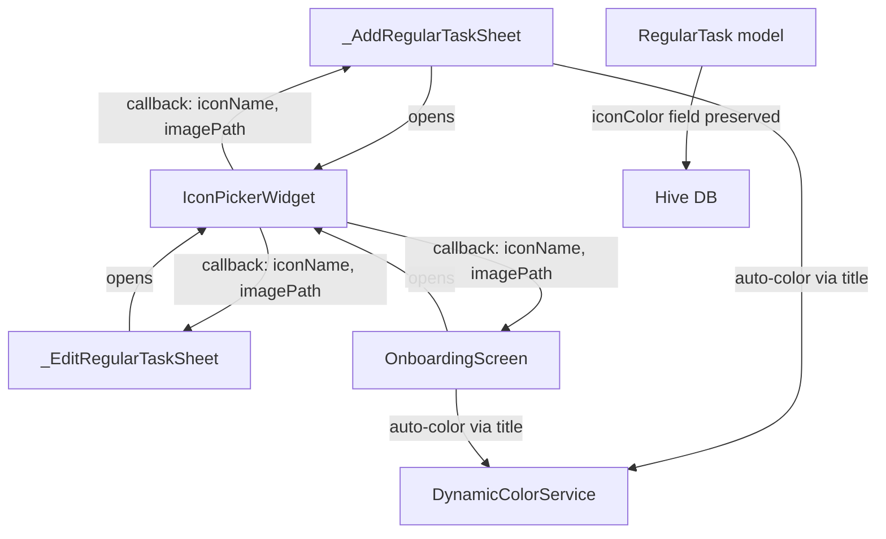

# Design Document: Remove Color Palette from Create Task

## Overview

This design removes the manual color selection tab from `IconPickerWidget` and simplifies its public API. The Color tab is redundant because `DynamicColorService` already auto-assigns colors based on task titles. The change touches three layers:

1. **Widget layer** — `IconPickerWidget` drops from 3 tabs to 2, removes the `selectedColor` constructor parameter, and narrows its callback from `(iconName, imagePath, color)` to `(iconName, imagePath)`.
2. **Consumer layer** — All call sites (`_AddRegularTaskSheet`, `_EditRegularTaskSheet`, onboarding screen) update to the new 2-parameter callback and stop passing `selectedColor`.
3. **Data layer** — `RegularTask.iconColor` field is preserved unchanged for backward compatibility. Existing stored colors continue to render; new tasks get colors exclusively from `DynamicColorService`.

No new services, models, or packages are introduced. The `DynamicColorService` and `ChallengeIconService` remain untouched.

## Architecture

The change is localized to the icon-picker widget and its three consumer screens. No architectural patterns change.



### Key Design Decisions

1. **Remove color from the widget entirely** rather than hiding the tab. The `_buildColorPickerTab()` method, the `_selectedColor` state variable, and the `selectedColor` constructor parameter are all deleted. This keeps the widget clean rather than carrying dead code.

2. **Narrow the callback signature** from 3 parameters to 2. The color parameter is removed because the widget no longer has any color-selection responsibility. Callers that need a color derive it from `DynamicColorService.getColorForText(title)` at the point of use, which they already do today.

3. **Keep `iconColor` on the data model**. The `RegularTask` Hive field (`@HiveField(6)`) must remain to avoid breaking deserialization of existing data. Removing a Hive field would corrupt stored tasks.

4. **Icon default color fallback stays in `_buildIconOption`**. When a user taps an icon, the icon tile renders using `iconData.color` (the icon's default color from `ChallengeIconService`). This is purely visual within the picker — the actual task color is determined by `DynamicColorService` based on the title.

## Components and Interfaces

### IconPickerWidget (modified)

**Before:**
```dart
class IconPickerWidget extends StatefulWidget {
  final String? selectedIconName;
  final String? selectedImagePath;
  final int? selectedColor;
  final Function(String? iconName, String? imagePath, int? color) onSelectionChanged;
}
```

**After:**
```dart
class IconPickerWidget extends StatefulWidget {
  final String? selectedIconName;
  final String? selectedImagePath;
  final Function(String? iconName, String? imagePath) onSelectionChanged;
}
```

**Internal changes:**
- `TabController(length: 3)` → `TabController(length: 2)`
- Remove `_selectedColor` state variable
- Remove `_buildColorPickerTab()` method
- Remove Color tab from `TabBar` and `TabBarView`
- Update `_buildIconOption` to always use `iconData.color` for rendering (no `_selectedColor` override)
- Update all `onSelectionChanged` invocations to pass only 2 arguments

### _AddRegularTaskSheet (modified)

**`_showIconPicker()` changes:**
- Stop passing `selectedColor` to `IconPickerWidget`
- Update callback from `(iconName, imagePath, color)` to `(iconName, imagePath)`
- Remove `iconColor: color ?? _challenge.iconColor` — the color is already set by `DynamicColorService` in the `onChanged` handler of the title `TextField`

### _EditRegularTaskSheet (modified)

**`_showIconPicker()` changes:**
- Stop passing `selectedColor` to `IconPickerWidget`
- Update callback from `(iconName, imagePath, color)` to `(iconName, imagePath)`
- Preserve existing `_challenge.iconColor` when rebuilding the `Challenge` object (no color override from picker)

### OnboardingScreen (modified)

**`_showIconPicker()` changes:**
- Stop passing `selectedColor` to `IconPickerWidget`
- Update callback from `(iconName, imagePath, color)` to `(iconName, imagePath)`
- Preserve existing `_challenges[index].iconColor` (already set by `DynamicColorService` during title input)

### DynamicColorService (unchanged)

No modifications. `getColorForText(String text)` continues to provide deterministic color assignment based on title hash.

### RegularTask model (unchanged)

No modifications. `iconColor` field (`@HiveField(6)`, `int?`) remains for backward compatibility.

## Data Models

### RegularTask (no changes)

```dart
@HiveField(6)
final int? iconColor; // ARGB32 int, nullable — preserved as-is
```

The field continues to be:
- **Written** when a new task is created (value from `DynamicColorService.getColorForText(title).toARGB32()`)
- **Read** when rendering task icons (via `ChallengeIconWidget`)
- **Preserved** when editing a task (carried forward from the existing `Challenge` object)

### Challenge model (no changes)

The `Challenge` model's `iconColor` field is unaffected. It serves as the in-memory form object during task creation/editing.


## Correctness Properties

*A property is a characteristic or behavior that should hold true across all valid executions of a system — essentially, a formal statement about what the system should do. Properties serve as the bridge between human-readable specifications and machine-verifiable correctness guarantees.*

### Property 1: DynamicColorService determinism and palette membership

*For any* non-empty string, calling `DynamicColorService.getColorForText` twice with the same string SHALL return the same color, and that color SHALL be a member of the predefined `_vibrantColors` palette.

**Validates: Requirements 2.1**

### Property 2: RegularTask iconColor serialization round-trip

*For any* `RegularTask` instance with any `iconColor` value (including null), serializing via `toJson()` and deserializing via `fromJson()` SHALL produce a task whose `iconColor` equals the original.

**Validates: Requirements 4.1**

## Error Handling

This feature is a removal/simplification — it reduces surface area rather than adding new failure modes. Error handling considerations:

1. **Compile-time safety** — Removing the `selectedColor` parameter and narrowing the callback signature means any caller that still passes the old arguments will fail at compile time. This is the primary guard against incomplete migration.

2. **Null iconColor on new tasks** — If a task is created before `DynamicColorService` assigns a color (e.g., empty title), `iconColor` remains null. The rendering layer (`ChallengeIconWidget`) already handles null `iconColor` by falling back to `DynamicColorService.getColorForText(title)` or the icon's default color. No new null-handling is needed.

3. **Existing tasks with stored colors** — Tasks created before this change have `iconColor` values stored in Hive. Since the `RegularTask` model and Hive field are unchanged, these values deserialize correctly. No migration is needed.

4. **Image picker errors** — The existing `_pickImage` error handling (try/catch with SnackBar) is unaffected by this change.

## Testing Strategy

### Property-Based Tests

Use the `dart_check` or `glados` package (whichever is already in the project, or add `glados` if neither exists) for property-based testing. Each property test runs a minimum of 100 iterations.

| Property | Test Description | Tag |
|----------|-----------------|-----|
| Property 1 | Generate random non-empty strings, verify `getColorForText` is deterministic and returns a palette color | Feature: remove-color-palette-create-task, Property 1: DynamicColorService determinism and palette membership |
| Property 2 | Generate random `RegularTask` instances with random `iconColor` values, verify `toJson`/`fromJson` round-trip preserves `iconColor` | Feature: remove-color-palette-create-task, Property 2: RegularTask iconColor serialization round-trip |

### Unit Tests (Example-Based)

| Requirement | Test Description |
|-------------|-----------------|
| 1.1, 1.2 | Widget test: `IconPickerWidget` renders exactly 2 tabs ("Icons", "Image") and no "Color" tab |
| 2.2 | Widget test: tapping an icon invokes callback with `(iconName, null)` — no color parameter |
| 3.3 | Widget test: selecting an icon produces `(non-null iconName, null imagePath)` |
| 3.4 | Widget test: selecting an image produces `(null iconName, non-null imagePath)` |
| 4.3 | Unit test: editing a task without changing title preserves original `iconColor` |

### Smoke Tests

| Requirement | Test Description |
|-------------|-----------------|
| 2.3 | `RegularTask` can be constructed with an `iconColor` value and the field is accessible |
| 3.1, 3.2 | Compilation succeeds with the new 2-parameter callback and without `selectedColor` constructor param |

### Integration Tests

| Requirement | Test Description |
|-------------|-----------------|
| 1.3, 1.4, 1.5 | Open `IconPickerWidget` from each flow (add, edit, onboarding) and verify 2-tab layout |
| 4.2 | Create a task with a stored `iconColor`, render it, verify the color is used |

### What Is NOT Tested with PBT

- Tab count and layout (UI structure — use widget tests)
- Callback parameter count (compile-time guarantee)
- Image picker interactions (side-effect-heavy, use example-based widget tests)
- Hive persistence of existing tasks (integration concern, use example-based tests)
