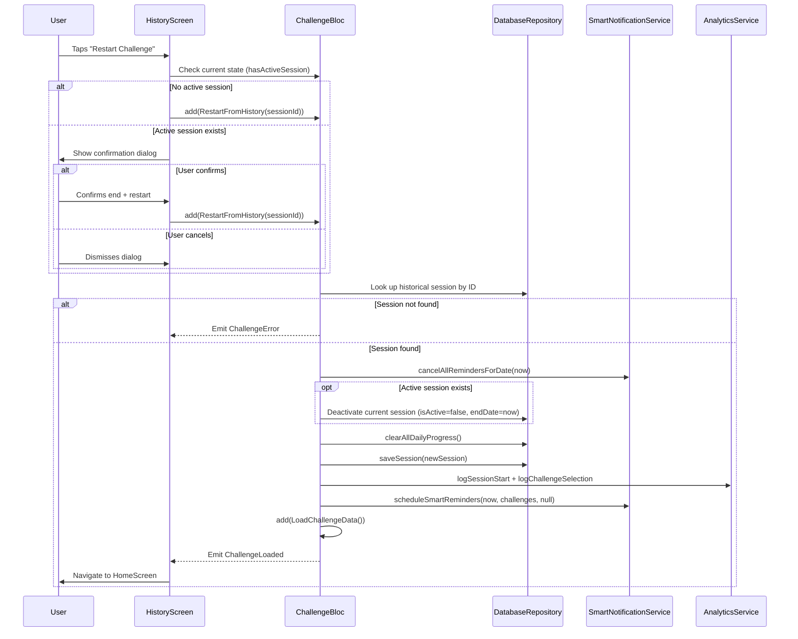

# Design Document: Restart Challenge from History

## Overview

This feature adds the ability for users to restart a past challenge session directly from the Challenge History screen. Instead of going through the full onboarding flow (welcome page → challenge setup → review), users tap a "Restart Challenge" button on any historical session card and immediately begin a new session with the same task configuration.

The implementation touches three layers:
1. **UI layer** — Enhanced `HistoryScreen` with detailed session info and a restart button, plus a confirmation dialog when an active session exists.
2. **BLoC layer** — A new `RestartFromHistory` event in `ChallengeBloc` that encapsulates the restart logic, keeping it separate from `StartNewSession`.
3. **Data layer** — Reads the historical session from `DatabaseRepository`, clears progress, and persists the new session.

The design follows the existing BLoC patterns established by `StartNewSession` and reuses `DatabaseRepository`, `SmartNotificationService`, and `AnalyticsService` without modifications to their interfaces.

## Architecture



The flow mirrors `_onStartNewSession` closely but differs in two ways:
- It sources challenges from a historical session (by ID lookup) rather than from event parameters.
- It preserves `resetMode` and `totalDaysTarget` from the original session.

## Components and Interfaces

### 1. RestartFromHistory Event

New event class in `challenge_event.dart`:

```dart
class RestartFromHistory extends ChallengeEvent {
  final String sessionId;

  const RestartFromHistory(this.sessionId);

  @override
  List<Object> get props => [sessionId];
}
```

Carries only the session ID. The BLoC handler retrieves the full session from the repository, avoiding passing stale or large objects through the event.

### 2. ChallengeBloc Handler — `_onRestartFromHistory`

Registered in the constructor alongside existing handlers:

```dart
on<RestartFromHistory>(_onRestartFromHistory);
```

Handler logic:
1. Cancel all current reminders.
2. Look up the historical session by `sessionId` from `DatabaseRepository.getAllSessions()`.
3. If not found → emit `ChallengeError`.
4. If an active session exists → deactivate it (set `isActive: false`, `endDate: now`).
5. Clear all daily progress.
6. Create a new `ChallengeSession` with:
   - New ID (timestamp-based, same pattern as `StartNewSession`)
   - Same `challenges` list from the historical session
   - `startDate` = now
   - `currentDay` = 1, `isActive` = true, `isCompleted` = false
   - Same `resetMode` and `totalDaysTarget` from the historical session
7. Save the new session.
8. Log analytics (session start + challenge selection).
9. Schedule smart reminders.
10. Dispatch `LoadChallengeData()` to refresh state.

### 3. HistoryScreen Enhancements

**Session detail display** — The expanded `ExpansionTile` children section is enhanced to show:
- Reset mode (Hard / Soft) and total days target
- Per-challenge details: title, task type badge (hard/soft/regular), category, reminder configuration summary

**Restart button** — An `ElevatedButton` labeled "Restart Challenge" placed at the bottom of the expanded section, styled with the app's orange accent color.

**Confirmation dialog** — When `state.hasActiveSession` is true, tapping the restart button shows an `AlertDialog` with:
- Title: "Active Challenge in Progress"
- Body: explains the current session will be ended
- Actions: "Cancel" (dismisses) and "End & Restart" (dispatches `RestartFromHistory`)

**Navigation** — After the BLoC emits `ChallengeLoaded` with the new session, the screen uses `Navigator.pushReplacementNamed(context, '/home')` to navigate to the home screen.

### 4. BlocListener for Restart Navigation

A `BlocListener` on the `HistoryScreen` listens for state transitions. When a `ChallengeLoaded` state is emitted after a restart action, it triggers navigation to the home screen. A local flag (`_isRestarting`) tracks whether a restart is in progress to distinguish restart-triggered loads from normal loads.

## Data Models

No new models are introduced. The feature reuses existing models:

| Model | Role in Feature |
|---|---|
| `ChallengeSession` | Source of historical config (challenges, resetMode, totalDaysTarget). Template for the new session via `copyWith`. |
| `Challenge` | Copied as-is from the historical session into the new session. All fields (title, taskType, category, reminderTime, reminderType, etc.) are preserved. |
| `DailyProgress` | Cleared on restart via `clearAllDailyProgress()`. Fresh progress entries are created as the user interacts with the new session. |

The new `ChallengeSession` is constructed with a fresh ID and start date while carrying over the challenge list and configuration fields from the historical session. The `copyWith` method on `ChallengeSession` is not used directly because several fields need to be reset (id, startDate, currentDay, isActive, isCompleted, endDate, failureReason, failedChallenges), making explicit construction clearer.


## Correctness Properties

*A property is a characteristic or behavior that should hold true across all valid executions of a system — essentially, a formal statement about what the system should do. Properties serve as the bridge between human-readable specifications and machine-verifiable correctness guarantees.*

### Property 1: Session restart preserves configuration and resets state fields

*For any* valid historical `ChallengeSession` (with any combination of challenges, resetMode, and totalDaysTarget), when the restart logic creates a new session from it, the new session SHALL:
- contain the exact same `challenges` list (same length, same elements in order)
- have the same `resetMode` as the historical session
- have the same `totalDaysTarget` as the historical session
- have `currentDay` equal to 1
- have `isActive` equal to true
- have `isCompleted` equal to false
- have a new unique `id` (different from the historical session's id)
- have `startDate` set to approximately the current time
- have `failureReason` as null
- have `failedChallenges` as null

**Validates: Requirements 3.1, 3.2, 3.3, 3.4, 5.4**

### Property 2: Active session deactivation on restart

*For any* active `ChallengeSession` and *any* historical `ChallengeSession`, when a restart is performed while the active session exists, the previously active session SHALL be updated to have `isActive` equal to false and `endDate` set to a non-null value representing the current time.

**Validates: Requirements 4.3**

## Error Handling

| Scenario | Handling |
|---|---|
| Historical session ID not found in repository | Emit `ChallengeError('Failed to restart: session not found')`. No state changes occur. |
| Repository throws during session save | Catch exception, log via `AnalyticsService.logError()`, emit `ChallengeError` with descriptive message. |
| Notification scheduling fails | Non-critical — catch and log the error but still complete the restart. The session is already saved at this point. Follows the same pattern as `_onUpdateDailyProgress`. |
| Analytics logging fails | Non-critical — swallow the error. Analytics should never block the restart flow. |
| User taps restart on a session that has since been deleted | The repository lookup returns null, handled by the "session not found" case above. |

## Testing Strategy

### Unit Tests (Example-Based)

These cover specific scenarios, UI interactions, and integration points:

1. **Widget tests for HistoryScreen enhancements:**
   - Session card displays start date, end date, duration, reset mode, total days target (Req 1.1)
   - Expanded card shows challenge title, task type, category, reminder config (Req 1.2)
   - Reset session card shows failure reason and failed challenges (Req 1.3)
   - Completed session card shows completion indicator (Req 1.4)
   - Restart button is present and labeled "Restart Challenge" (Req 2.1, 2.2)
   - Restart button has screen reader semantics (Req 2.3)

2. **Widget tests for confirmation dialog:**
   - Dialog appears when restart tapped with active session (Req 4.1)
   - Dialog has "Cancel" and "End & Restart" buttons (Req 4.2)
   - Cancel dismisses dialog without dispatching events (Req 4.4)

3. **BLoC unit tests:**
   - `RestartFromHistory` event is accepted by the BLoC (Req 5.1)
   - BLoC retrieves session from repository by ID (Req 5.2)
   - BLoC emits `ChallengeError` when session not found (Req 5.3)
   - Navigation to home screen after successful restart (Req 3.7)
   - `clearAllDailyProgress()` is called during restart (Req 3.5)
   - `scheduleSmartReminders()` is called with new session's challenges (Req 3.6)

### Property-Based Tests

Property-based tests use the `dart_quickcheck` or `glados` library (Dart PBT libraries) with a minimum of 100 iterations per property.

1. **Property 1: Session restart preserves configuration and resets state fields**
   - Generate random `ChallengeSession` objects with varying challenges lists (0-10 challenges with random titles, task types, categories, reminder configs), random resetMode ('hard'/'soft'), and random totalDaysTarget (1-365).
   - Pass through the session creation logic (extracted as a pure function for testability).
   - Assert all preserved fields match and all reset fields have correct initial values.
   - Tag: `Feature: restart-challenge-from-history, Property 1: Session restart preserves configuration and resets state fields`

2. **Property 2: Active session deactivation on restart**
   - Generate random pairs of (active session, historical session).
   - Execute the deactivation logic.
   - Assert the previously active session has `isActive == false` and `endDate != null`.
   - Tag: `Feature: restart-challenge-from-history, Property 2: Active session deactivation on restart`

### Testability Design Decision

To make the restart logic property-testable, the session creation logic should be extracted into a pure helper function:

```dart
ChallengeSession createRestartedSession(ChallengeSession historicalSession) {
  return ChallengeSession(
    id: DateTime.now().millisecondsSinceEpoch.toString(),
    challenges: historicalSession.challenges,
    startDate: DateTime.now(),
    isActive: true,
    isCompleted: false,
    currentDay: 1,
    resetMode: historicalSession.resetMode,
    totalDaysTarget: historicalSession.totalDaysTarget,
  );
}
```

This pure function can be tested with property-based tests independently of the BLoC, repository, and notification service. The BLoC handler calls this function and handles the side effects (persistence, notifications, analytics) separately.
