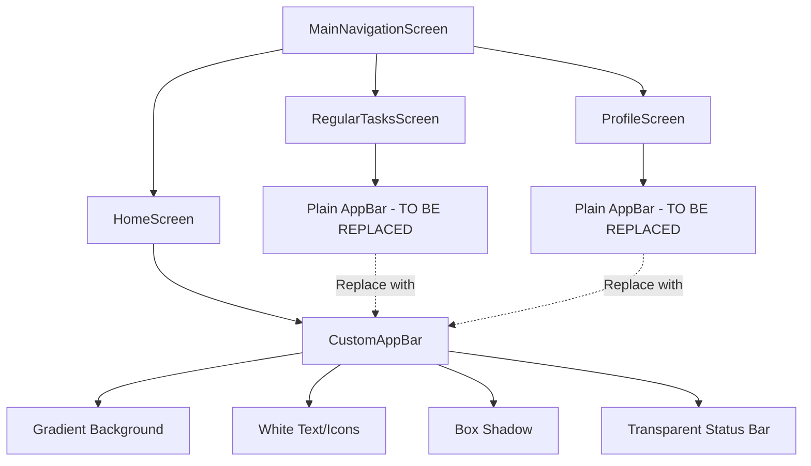
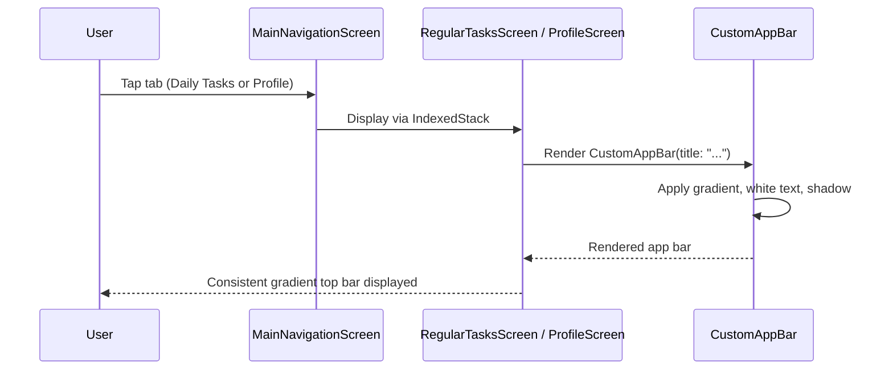

# Design Document: Sync Top Bar Styling

## Overview

This feature synchronizes the top bar (app bar) styling across all three main navigation tabs—Home, Regular Tasks, and Profile—so they share a consistent visual identity. Currently, only the Home screen uses the `CustomAppBar` widget with a gradient background, while the Regular Tasks and Profile screens use a plain white `AppBar`. The goal is to replace the plain `AppBar` in `RegularTasksScreen` and `ProfileScreen` with the existing `CustomAppBar` widget, achieving visual consistency without modifying the widget itself.

This is a straightforward UI consistency fix that requires minimal code changes—swapping out the `AppBar` widget usage in two screens and adding the necessary import.

## Architecture



## Sequence Diagram



## Components and Interfaces

### Component: CustomAppBar (Existing - No Changes)

**Purpose**: Provides a reusable app bar with gradient background, white text/icons, and box shadow.

**Interface**:
```dart
class CustomAppBar extends StatelessWidget implements PreferredSizeWidget {
  final String title;
  final List<Widget>? actions;
  final Widget? leading;
  final bool automaticallyImplyLeading;
  final double elevation;
  final bool centerTitle;

  const CustomAppBar({
    super.key,
    required this.title,
    this.actions,
    this.leading,
    this.automaticallyImplyLeading = true,
    this.elevation = 0,
    this.centerTitle = true,
  });

  @override
  Size get preferredSize => const Size.fromHeight(kToolbarHeight);
}
```

**Responsibilities**:
- Render gradient background (orange → orange-red → pink)
- Display title in white, bold, 20px with 0.5 letter spacing
- Apply white icon theme to actions and leading widgets
- Add subtle box shadow beneath the bar
- Set transparent status bar with light icons

### Component: RegularTasksScreen (Modified)

**Purpose**: Displays the list of regular/daily tasks with completion tracking.

**Current AppBar** (to be replaced):
```dart
appBar: AppBar(
  title: Text('Regular Tasks',
      style: GoogleFonts.poppins(fontWeight: FontWeight.w600)),
  backgroundColor: Colors.white,
  elevation: 0,
  centerTitle: true,
),
```

**New AppBar**:
```dart
appBar: const CustomAppBar(
  title: 'Regular Tasks',
),
```

### Component: ProfileScreen (Modified)

**Purpose**: Displays user profile, sync status, and challenge statistics.

**Current AppBar** (to be replaced):
```dart
appBar: AppBar(
  title: Text('Profile',
      style: GoogleFonts.poppins(fontWeight: FontWeight.w600)),
  backgroundColor: Colors.white,
  elevation: 0,
  centerTitle: true,
),
```

**New AppBar**:
```dart
appBar: const CustomAppBar(
  title: 'Profile',
),
```

## Data Models

No data model changes are required for this feature. The `CustomAppBar` widget already accepts all necessary parameters.

## Key Functions with Formal Specifications

### Function: RegularTasksScreen.build()

```dart
@override
Widget build(BuildContext context) → Widget
```

**Preconditions:**
- `context` is a valid `BuildContext` with access to `RegularTaskBloc` via BlocProvider
- `CustomAppBar` widget is importable from `'../widgets/custom_app_bar.dart'`

**Postconditions:**
- Returns a `Scaffold` with `CustomAppBar` as the `appBar` property
- The app bar displays "Regular Tasks" as the title
- The app bar renders with the gradient background, white text, and shadow
- The body content remains unchanged

**Loop Invariants:** N/A

### Function: ProfileScreen.build()

```dart
@override
Widget build(BuildContext context) → Widget
```

**Preconditions:**
- `context` is a valid `BuildContext` with access to `ChallengeBloc` via BlocProvider
- `CustomAppBar` widget is importable from `'../widgets/custom_app_bar.dart'`

**Postconditions:**
- Returns a `Scaffold` with `CustomAppBar` as the `appBar` property
- The app bar displays "Profile" as the title
- The app bar renders with the gradient background, white text, and shadow
- The body content remains unchanged

**Loop Invariants:** N/A

## Algorithmic Pseudocode

### Migration Algorithm

```dart
// For each screen that needs updating (RegularTasksScreen, ProfileScreen):
//
// STEP 1: Add import
//   Add: import '../widgets/custom_app_bar.dart';
//   Remove (if unused elsewhere): import 'package:google_fonts/google_fonts.dart';
//
// STEP 2: Replace AppBar in build() method
//   Remove:
//     appBar: AppBar(
//       title: Text('<Title>', style: GoogleFonts.poppins(...)),
//       backgroundColor: Colors.white,
//       elevation: 0,
//       centerTitle: true,
//     ),
//
//   Replace with:
//     appBar: const CustomAppBar(
//       title: '<Title>',
//     ),
//
// STEP 3: Verify no other usages of GoogleFonts in the file
//   If GoogleFonts is not used elsewhere → remove the import
//   If GoogleFonts is still used → keep the import
```

## Example Usage

```dart
// Before (RegularTasksScreen):
import 'package:google_fonts/google_fonts.dart';

class _RegularTasksScreenState extends State<RegularTasksScreen> {
  @override
  Widget build(BuildContext context) {
    return Scaffold(
      appBar: AppBar(
        title: Text('Regular Tasks',
            style: GoogleFonts.poppins(fontWeight: FontWeight.w600)),
        backgroundColor: Colors.white,
        elevation: 0,
        centerTitle: true,
      ),
      body: /* ... */,
    );
  }
}

// After (RegularTasksScreen):
import '../widgets/custom_app_bar.dart';

class _RegularTasksScreenState extends State<RegularTasksScreen> {
  @override
  Widget build(BuildContext context) {
    return Scaffold(
      appBar: const CustomAppBar(
        title: 'Regular Tasks',
      ),
      body: /* ... */,
    );
  }
}

// After (ProfileScreen):
import '../widgets/custom_app_bar.dart';

class _ProfileScreenState extends State<ProfileScreen> {
  @override
  Widget build(BuildContext context) {
    return Scaffold(
      appBar: const CustomAppBar(
        title: 'Profile',
      ),
      body: /* ... */,
    );
  }
}
```

## Correctness Properties

1. **Visual Consistency**: ∀ screen ∈ {HomeScreen, RegularTasksScreen, ProfileScreen}, the app bar rendered by that screen uses the same gradient colors, text style, and shadow as defined in `CustomAppBar`.

2. **Title Preservation**: ∀ screen ∈ {RegularTasksScreen, ProfileScreen}, the title text displayed in the app bar after migration matches the original title text ("Regular Tasks", "Profile").

3. **No Body Regression**: ∀ screen ∈ {RegularTasksScreen, ProfileScreen}, the `body` content of the `Scaffold` remains identical before and after the migration.

4. **Widget Tree Validity**: ∀ screen ∈ {RegularTasksScreen, ProfileScreen}, the `Scaffold.appBar` property receives a widget that implements `PreferredSizeWidget` (which `CustomAppBar` does).

5. **Import Correctness**: ∀ screen ∈ {RegularTasksScreen, ProfileScreen}, the file imports `'../widgets/custom_app_bar.dart'` and the `google_fonts` import is removed only if not used elsewhere in the file.

## Error Handling

### Error Scenario 1: Missing Import

**Condition**: Developer forgets to add the `custom_app_bar.dart` import
**Response**: Dart analyzer will report a compile-time error ("Undefined class 'CustomAppBar'")
**Recovery**: Add the missing import statement

### Error Scenario 2: GoogleFonts Import Removal When Still Used

**Condition**: The `google_fonts` import is removed but GoogleFonts is still used elsewhere in the file
**Response**: Dart analyzer will report a compile-time error ("Undefined name 'GoogleFonts'")
**Recovery**: Restore the `google_fonts` import

## Testing Strategy

### Visual Verification

- Navigate to each tab and confirm the gradient app bar appears
- Compare the app bar appearance across all three tabs for consistency
- Verify the title text is correct on each tab
- Verify status bar icons are light (white) on all tabs

### Widget Testing

- Verify `RegularTasksScreen` renders a `CustomAppBar` with title "Regular Tasks"
- Verify `ProfileScreen` renders a `CustomAppBar` with title "Profile"
- Verify no `GoogleFonts.poppins` usage remains in the app bar sections

### Regression Testing

- Confirm body content of Regular Tasks screen still displays task list correctly
- Confirm body content of Profile screen still displays profile information correctly
- Confirm navigation between tabs works without visual glitches

## Dependencies

- `lib/widgets/custom_app_bar.dart` — existing widget, no modifications needed
- No new package dependencies required
- The `google_fonts` package import may be removable from the modified files if not used elsewhere in those files
